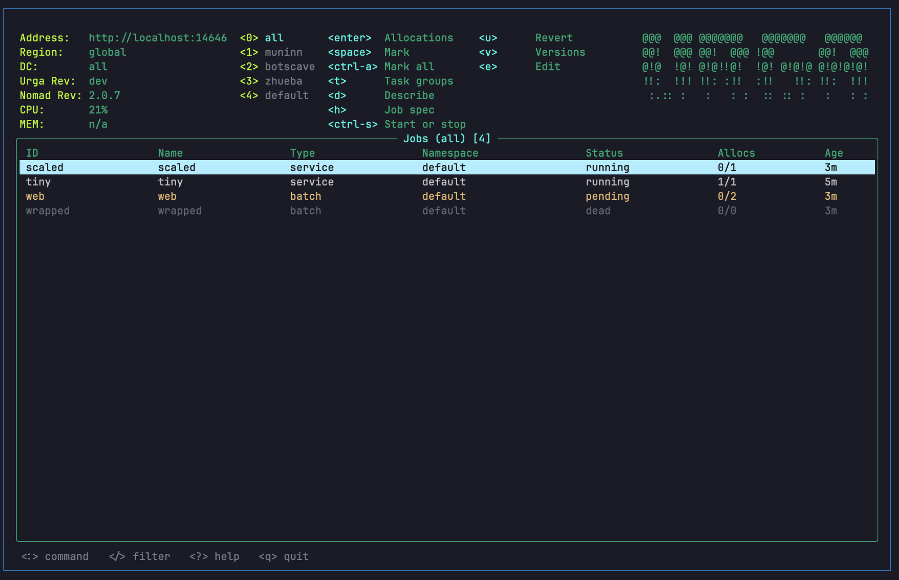
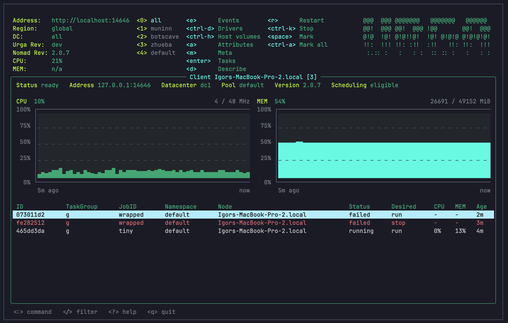

<div align="center">

<picture>
  <source media="(prefers-color-scheme: dark)" srcset="docs/images/logo-dark.png">
  
</picture>

# urga

**A terminal UI for HashiCorp Nomad.**
One binary, no config to write, no browser.

[](https://github.com/ingvarch/urga/actions/workflows/ci.yml)
[](https://github.com/ingvarch/urga/releases/latest)
[](go.mod)
[](LICENSE)

</div>





## Install

On macOS, with Homebrew:

```sh
brew install ingvarch/tap/urga
```

On Debian, Ubuntu, Fedora or RHEL, take the `.deb` or the `.rpm` for your
machine from the [releases](https://github.com/ingvarch/urga/releases) and
install it with the package manager:

```sh
sudo apt install ./urga_*_amd64.deb
sudo dnf install ./urga-*.x86_64.rpm
```

Anywhere else, download the archive for your machine from the same page —
Linux, macOS, Windows and FreeBSD, on amd64 and arm — or install it with Go:

```sh
go install github.com/ingvarch/urga/cmd/urga@latest
```

Or build from a clone:

```sh
make build && ./bin/urga
```

## Use

urga reads the same environment as the `nomad` command:

| Variable | What it is |
| --- | --- |
| `NOMAD_ADDR` | Address of the cluster, defaults to `http://127.0.0.1:4646` |
| `NOMAD_TOKEN` | ACL token, when the cluster asks for one |
| `NOMAD_REGION` | Region to ask in, the one of the agent when unset |
| `NOMAD_NAMESPACE` | Namespace of the first run, every namespace when unset |
| `NOMAD_HTTP_AUTH` | `user:password` for a cluster behind HTTP basic auth |
| `NOMAD_CACERT` | CA certificate to check the cluster against |
| `NOMAD_CAPATH` | Directory of CA certificates, instead of one file |
| `NOMAD_CLIENT_CERT` | Client certificate, when the cluster asks for one |
| `NOMAD_CLIENT_KEY` | Key of the client certificate |
| `NOMAD_TLS_SERVER_NAME` | Server name to check the certificate against |
| `NOMAD_SKIP_VERIFY` | `true` skips checking the certificate of the cluster |

Flags override it:

```sh
urga --address https://nomad.example.com --region eu --namespace production
```

A resource is edited in `$VISUAL`, or in `$EDITOR` when that is unset.

`--readonly` changes nothing in the cluster. The keys that would are taken
away: start and stop, revert, edit, scale, restart, drain, eligibility,
promote, fail and the shell. The header says `read-only` next to the address.

### Named clusters

Nothing above needs a file. A file is only for naming the clusters you work
with, so that urga knows each one's address, token and how careful to be with
it. Without the file urga runs from the environment, as it always did.

The file is `~/.config/urga/clusters.toml` (`$XDG_CONFIG_HOME/urga` when that
is set):

```toml
default = "dev"

[clusters.dev]
address   = "http://127.0.0.1:4646"
namespace = "default"

[clusters.prod]
address         = "https://nomad.prod.example.com:4646"
region          = "eu"
token_command   = ["op", "read", "op://ops/nomad/token"]
ca_cert         = "~/.nomad/prod-ca.pem"
tls_server_name = "server.eu.nomad"
read_only       = true
```

`urga --cluster prod` starts on `prod`; without the flag urga starts on the
`default` of the file, and without that from the environment. The header then
says `Cluster:` and the name. Flags still win over the file.

A named cluster takes nothing from the environment: a `NOMAD_TOKEN` set for
one cluster is not sent to another. Its token comes from one of:

| Key | Where the token is |
| --- | --- |
| `token_env` | An environment variable of that name |
| `token_command` | What the command prints, such as a password manager |
| `token` | In the file itself, which is best kept out of it |

The certificates are `ca_cert`, `client_cert`, `client_key` and
`tls_server_name`. `read_only = true` is `--readonly` for that cluster. A key
urga does not know stops it with the name of the key, so a typo does not go
unnoticed.

## Keys

Type `:` for the command line: `jobs`, `deployments`, `namespaces`, `services`,
`evaluations`, `clients`, `servers`, `variables`, `nodepools`, or the short
forms `jb`, `dp`, `ns`, `svc`, `ev`, `no`, `srv`, `vars`, `np`. Clients answer
to `nodes` as well, the word Nomad's own CLI uses. A letter is enough: the
line finishes the word it fits, `up` and `down` walk through the rest of
them, `tab` or `right` takes what is offered, `enter` opens it. A second word
switches the namespace with it, as in `jobs production`. `q` leaves.

`region eu` asks another region of the cluster from then on and goes back to
the list the open screen came from; the datacenter goes back to all of them.
`dc dc2` narrows the jobs, the clients, the servers and the CPU and memory in
the header to one datacenter, `dc all` brings every one of them back. Either
word on its own opens a list of them with the one in use marked: `enter`
switches to the one under the cursor, `esc` leaves things as they were. The
header shows both under the address.

| Key | What it does |
| --- | --- |
| `:` | Command line |
| `/` | Filter what is on the screen: a pattern, `!` for everything else, `-f ` for the letters in that order |
| `?` | Help, with the keys of the open resource |
| `0`–`9` | Switch namespace, `0` is all of them |
| `A`–`Z` | Sort by the column that starts with that letter, again to reverse |
| `!` | Only what needs attention, again for all of it |
| `enter` | Open what the cursor is on: a client opens what it runs, a server what the agent says about itself, an evaluation how it ended |
| `esc` | Back, to the row the list was left on, with its filter and order |
| `d` | Describe |
| `h` | The job file the job was submitted with |
| `e` | Edit a job, a namespace or the metadata of a client in your editor; the events of a client or of a task. A job the cluster kept no file of opens as JSON, and an edited job is planned before it is sent |
| `t` | Task groups of a job |
| `s` | Scale a task group, or a shell in a task; on a log or a file, autoscroll on or off |
| `v` | Versions of a job, with what each one changed |
| `u` | Revert a job to its previous version, or on the versions screen to the one under the cursor, after its plan |
| `space` | Mark a row, on jobs, allocations and clients; an action then takes every marked row |
| `ctrl-a` | Mark every row on the screen, or none |
| `ctrl-s` | Start or stop a job, or every marked one |
| `r` | Restart an allocation, or every marked one; on the tasks of an allocation, the task under the cursor; on a plan, plan it again |
| `ctrl-k` | Stop an allocation, or every marked one |
| `x` | Send a signal to the task under the cursor: `hup`, `SIGUSR1`, any name the client knows |
| `b` | Browse the files of the task under the cursor, from its directory; `..` goes up to the allocation |
| `ctrl-d` | Drain a client, or every marked one; on a client, what it can run |
| `ctrl-h` | Host volumes of a client |
| `a` | Attributes of a client |
| `m` | Metadata of a client |
| `i` | Let a client take new work, or stop it; every marked one at once |
| `p` | Promote the canaries of a deployment; on a job or task group that waits, why it is not placed; on the tasks of an allocation or on a log, the allocation it replaced |
| `f` | Fail a deployment; on the tasks of an allocation, the evaluation that will place it again |
| `c` | Copy the value under the cursor, on a screen of fields; on the tasks of an allocation, the client it runs on |
| `n` | On the tasks of an allocation, the allocation that replaced it |
| `y` | On a plan, submit the edit or the revert it shows |
| `ctrl-e` | Logs of a task, stderr; on a log, the other of stdout and stderr |
| `w` | Wrap long lines, on logs, files and descriptions |
| `t` | Show when urga read each log line; a task writes no time of its own |
| `ctrl-s` | Save what is on the screen to a file, as the filter left it |
| `q` | Quit |

## What works

Jobs, allocations, tasks, task groups, deployments, namespaces, services,
evaluations, clients, servers, variables and node pools. A screen that the
cluster will talk about follows its event stream and is asked again the moment
something changes; the rest are asked on a timer. A cluster that will not
stream — an ACL that does not allow it, most often — is polled instead, and
the status line says so. The tasks of an allocation open under what it is:
its status, the client it runs on, the version of its job, how its deployment
judged it, the ports it listens on, the allocations before and after it, and
while it runs, its checks: the failing ones first, each with why it failed.
Checks are read every few seconds, for services the cluster registers itself.
The files of a task open on its directory, where `local/` holds what its
templates rendered; `..` goes up to the directory its allocation shares. A
file reads like a log: from its top, growing as it grows, with autoscroll a key
away. One over a MiB opens at its last MiB, and the title says so. A pipe and a
file that is not text are not opened, and the status line says why.
A task says what happened to it, from the moment the client received it.
Logs open on the last of what a task wrote and follow it as it writes; a task
that finished is read to its end. stdout and stderr are a key apart, and so is
the log of the allocation a task was placed again from. A line under the title
says whether autoscroll, timestamps and wrap are on. The filter lights up what
it matched, long lines wrap, and what is on the screen saves to a file.

An evaluation opens on how it ended and, for every task group it could not
place, which nodes were filtered out and which ran out of room. A job or a task
group whose allocations wait for a place opens the same page for the newest
evaluation that could not place them. A job or a namespace opens in your
editor and goes back to the cluster when you save; a job is planned first. The
plan says what it could not place, what the scheduler would do to the
allocations of each group, and what would change, laid out as the job file with
the lines it takes out in red and the ones it puts in in green. Its foot asks
whether to send it, with Cancel and Submit buttons: the arrows or tab choose
one, enter presses it, `y` submits at once and `r` plans it again. A plan the
cluster has no room for cannot be submitted, and a job that changed since the
plan is refused rather than overwritten. Reverting a job goes through
the same plan. Jobs start, stop, revert and
scale; a job keeps its versions, each saying what it changed the same way, and goes back to
any of them; allocations restart and stop; jobs start and stop; clients drain and take work
again — one of them, or as many as are marked; a task restarts on its own, takes a signal, or opens a shell. A signal the client does not know is refused before it is sent: the client would send SIGINT in its place. Clients drain and
take work again, deployments promote their canaries or fail. The servers list
says which one leads, and a server opens on everything its agent carries: the
addresses and ports, the gossip it speaks, whether the raft still counts its
vote, and every tag the cluster was built with. One key copies the value under
the cursor, over OSC52, so it works through ssh as well.

A client opens on what the machine is doing: its CPU and memory as a chart of
the readings taken while the screen is open, and the allocations it runs, from
every namespace. From there one key each opens what happened to it, the drivers
it has and what every one of them reports, the volumes it lends out, the
attributes it is built from and its metadata, which opens in your editor and
goes back to the machine when you save.

Allocations and clients say what they are using, the list sorts by any column,
and one key leaves only what needs attention.

The session comes back where it was left: the namespace, the resource and which
namespace each number key stands for. `--namespace` on the command line opens
another namespace; `NOMAD_NAMESPACE` does not, since the shell sets it for every
run. The session is kept in `urga/config.json` under `$XDG_CONFIG_HOME`, or under
the config directory of the system when that is unset (`~/.config` on Linux,
`~/Library/Application Support` on macOS).

## Contributing

How to build urga, run the checks and send a change is in
[CONTRIBUTING.md](CONTRIBUTING.md). Security problems are reported privately,
see [SECURITY.md](SECURITY.md).

## License

MIT, see [LICENSE](LICENSE).

## About the name

An urga is a Mongolian catch pole: a long wooden shaft with a loop of rope at
the end. A rider holds it out at a gallop and takes the one horse he wants out
of a herd of hundreds that is still moving.

A cluster is that herd. This is what you reach into it with.
